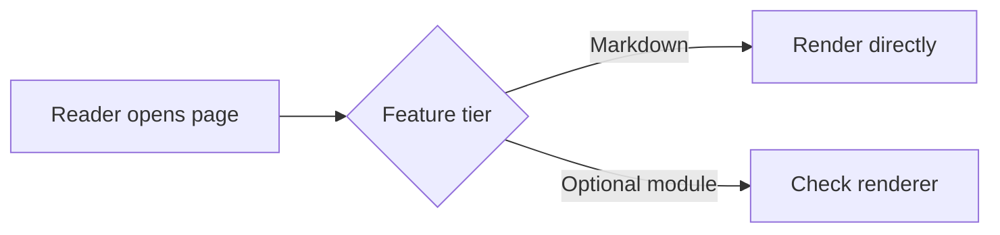

Use this page as the design and prompting reference for this documentation
repository. It demonstrates standard Markdown, Wiki.js-specific features,
renderer-dependent extensions, raw HTML, default-theme utility classes, and
safe CSS patterns on one page.

For complete rendered page compositions, responsive card systems, heroes,
dashboards, timelines, and navigation patterns, use the companion
[Wiki.js CSS & Layout Gallery](/wiki-css-layout-examples).

> **Reusable prompt:** Using `/wiki-page-examples` as the Wiki.js design
> reference, create or update `<route>`. Use standard Markdown and stable
> Wiki.js classes first. Use raw HTML only where it materially improves the
> layout. State which optional renderer modules or administrator settings the
> design requires. Keep it responsive, accessible, dark-mode readable, and
> compatible with Git storage.
{.is-info}

This reference targets Wiki.js 2.5-style Markdown and the conventions already
used in this repository. Its source review baseline is stable release
[2.5.314](https://github.com/requarks/wiki/tree/v2.5.314). The installed wiki's
version and administrator settings remain authoritative.

## Capability tiers {#capability-tiers}

| Tier | Safe assumption | Examples |
|---|---|---|
| A — Repository standard | Use freely | headings, text, links, lists, tables, code, images, alerts, `links-list`, `grid-list`, `dense` |
| B — Wiki.js renderer | Verify the module is enabled | tabs, emoji, footnotes, abbreviations, task lists, Mermaid, PlantUML, KaTeX |
| C — Raw HTML | Requires Markdown “Allow HTML”; sanitization still applies | `<details>`, `<figure>`, semantic layout, inline `style` |
| D — Theme/admin | Requires administrator access and can affect the whole wiki | CSS override, head/body injection, iframes, custom theme behavior |
{.dense}

> A page can render differently when its Markdown or HTML rendering modules are
> disabled. Keep critical instructions in Tier A; use Tiers B–D for progressive
> enhancement.
{.is-warning}

### Markdown core switches

An administrator controls these under **Administration → Rendering → Markdown
Core**:

| Setting | 2.5.314 default | Page effect |
|---|---:|---|
| Allow HTML | on | Permits raw HTML before the separate security sanitizer runs |
| Automatically convert links | on | Converts plain URLs into links |
| Automatically convert line breaks | on | Renders source line breaks inside paragraphs |
| Underline emphasis | off | Can reinterpret `_text_` as underline instead of ordinary emphasis |
| Typographer | off | Replaces neutral punctuation and quotation marks |
| Quotes style | English | Chooses replacements when Typographer is enabled |
{.dense}

This repository uses `*asterisks*` for emphasis and does not rely on optional
underline behavior.

### Renderer module baseline

The stable 2.5.314 source enables abbreviations, emoji, expanded tabs, footnotes,
image sizing, KaTeX, PlantUML, subscript/superscript, task lists, Mermaid,
tabsets, Twemoji, code highlighting, blockquote styling, and HTML security by
default. Administrators can still disable or reconfigure them.

Kroki, MathJax, MultiMarkdown tables, Pivot Tables, image prefetch, and
Asciinema are disabled by default. KaTeX and MathJax must not be enabled
together.

## Quick navigation {#quick-navigation}

- [Frontmatter and page rules](#frontmatter-and-page-rules)
- [Text and inline formatting](#text-and-inline-formatting)
- [Links and stable anchors](#links-and-stable-anchors)
- [Alerts and blockquotes](#alerts-and-blockquotes)
- [Lists and navigation cards](#lists-and-navigation-cards)
- [Tables](#tables)
- [Code and configuration](#code-and-configuration)
- [Tabs](#tab-source)
- [Images and assets](#images-and-assets)
- [Diagrams and math](#diagrams-and-math)
- [Raw HTML](#raw-html)
- [Layout and theme utilities](#layout-and-theme-utilities)
- [CSS and JavaScript boundaries](#css-and-javascript-boundaries)
- [Renderer inventory](#renderer-inventory)
- [Feature selection checklist](#feature-selection-checklist)
{.grid-list}

## Frontmatter and page rules {#frontmatter-and-page-rules}

Every Git-backed Markdown page in this repository starts with Wiki.js
frontmatter:

~~~yaml
---
title: "Readable Page Title"
description: "One sentence used for page metadata and search"
published: true
date: 2026-08-27T00:00:00.000Z
tags: "plugin-name, topic"
editor: markdown
dateCreated: 2026-08-27T00:00:00.000Z
---
~~~

Repository conventions:

1. Do not add a Markdown H1. Wiki.js renders `title` as the page title.
2. Start page content at `##`.
3. Use absolute wiki routes such as `/iris/00-overview`, never repository paths
   such as `iris/00-overview.md`.
4. Bump `date` when a page changes; preserve `dateCreated`.
5. Prefer verified product behavior over promotional language.
6. Use descriptive link text and image alt text.
7. Keep the source readable in GitHub even when Wiki.js enhancements are absent.

## Text and inline formatting {#text-and-inline-formatting}

Rendered:

Normal text, **bold text**, *italic text*, ***bold italic text***,
~~obsolete text~~, `inline code`, H~2~O, x^2^, <kbd>Ctrl</kbd> +
<kbd>K</kbd>, <mark>highlighted HTML text</mark>, and an escaped
\*literal asterisk\*.

Source:

~~~markdown
Normal text, **bold text**, *italic text*, ***bold italic text***,
~~obsolete text~~, `inline code`, H~2~O, x^2^, <kbd>Ctrl</kbd> +
<kbd>K</kbd>, <mark>highlighted HTML text</mark>, and an escaped
\*literal asterisk\*.
~~~

Subscript and superscript require their Markdown render module. `<kbd>` and
`<mark>` are raw HTML. Strikethrough is part of the GFM-style syntax supported
by Wiki.js.

A Markdown paragraph can contain a deliberate line break by ending a line with
two spaces. A blank line starts a new paragraph. Wiki.js can also be configured
to convert ordinary source line breaks automatically, so do not use manual
wrapping to imply important visual spacing.

---

The line above is a horizontal rule.

## Links and stable anchors {#links-and-stable-anchors}

- [Internal page link](/iris)
- [Same-page section link](#alerts-and-blockquotes)
- [External link](https://js.wiki/)
- [External link with a tooltip](https://js.wiki/ "Wiki.js project site")
- [Explicit new tab](https://docs.requarks.io/editors/markdown){target=_blank}
- Autolink: <https://github.com/VolmitSoftware/docs>

Source:

~~~markdown
[Internal page link](/iris)
[Same-page section link](#alerts-and-blockquotes)
[External link](https://js.wiki/)
[External link with a tooltip](https://js.wiki/ "Wiki.js project site")
[Explicit new tab](https://docs.requarks.io/editors/markdown){target=_blank}
<https://github.com/VolmitSoftware/docs>
~~~

Attach a stable custom anchor to a heading with:

~~~markdown
## Human-readable heading {#stable-anchor}
~~~

Wiki.js automatically generates heading anchors and a page table of contents.
Use an explicit ID when other pages or external sites need a link that should
survive a heading rename. Markdown attribute syntax accepts `id`, `class`, and
`target`; arbitrary attributes are not passed by this renderer.

## Alerts and blockquotes {#alerts-and-blockquotes}

> A plain blockquote is suitable for a quotation or secondary note.

> Information explains context without requiring action.
{.is-info}

> Success confirms an expected result or completed procedure.
{.is-success}

> Warning identifies a meaningful risk or compatibility concern.
{.is-warning}

> Danger marks destructive commands, data loss, or security exposure.
{.is-danger}

Source:

~~~markdown
> Information explains context without requiring action.
{.is-info}

> Success confirms an expected result or completed procedure.
{.is-success}

> Warning identifies a meaningful risk or compatibility concern.
{.is-warning}

> Danger marks destructive commands, data loss, or security exposure.
{.is-danger}
~~~

When a blockquote contains another decorated element, target the blockquote
explicitly:

> This alert contains a list:
> - First requirement
> - Second requirement
<!-- {blockquote:.is-info} -->

~~~markdown
> This alert contains a list:
> - First requirement
> - Second requirement
<!-- {blockquote:.is-info} -->
~~~

The `<!-- {tag:.class} -->` form is Wiki.js decorate syntax. It prevents the
class from accidentally attaching to the nested list instead of the blockquote.

## Lists and navigation cards {#lists-and-navigation-cards}

### Ordinary and nested lists

- First item
- Second item
  - Nested item
  - Another nested item
- Third item

1. Stop the server.
1. Back up the data.
1. Apply the change.
1. Verify the result.

Using `1.` for every ordered-list item lets Markdown number the steps
automatically.

### Task list

- [x] Source inspected
- [x] Documentation written
- [ ] Deployment verified

Task boxes are presentation, not persistent interactive form controls. Clicking
them on a rendered page does not edit the source.

### Grid list

- **Requirements** — Java, server, and dependency matrix
- **Installation** — first start and verification
- **Configuration** — every supported setting
- **Operations** — backups, upgrades, and recovery
{.grid-list}

~~~markdown
- **Requirements** — Java, server, and dependency matrix
- **Installation** — first start and verification
- **Configuration** — every supported setting
- **Operations** — backups, upgrades, and recovery
{.grid-list}
~~~

### Link list

- [Iris *World generation documentation*](/iris)
- [Wormholes *Rendered portals and travel*](/wormholes)
- [Contributing *Repository workflow and rules*](/contributing)
{.links-list}

~~~markdown
- [Iris *World generation documentation*](/iris)
- [Wormholes *Rendered portals and travel*](/wormholes)
- [Contributing *Repository workflow and rules*](/contributing)
{.links-list}
~~~

Use `grid-list` for compact peer concepts. Use `links-list` for prominent
destinations with optional italic subtitles.

## Tables {#tables}

### Standard table with alignment

| Setting | Type | Default | Purpose |
|:---|:---:|---:|:---|
| `enabled` | boolean | `true` | Enables the feature |
| `radius` | integer | `32` | Maximum search radius |
| `mode` | enum | `safe` | Selects the behavior profile |

Alignment comes from colons in the delimiter row:

~~~markdown
| Left | Center | Right |
|:---|:---:|---:|
| A | B | C |
~~~

### Dense table

| Node | Default | Scope |
|---|---|---|
| `example.use` | `true` | Player-facing action |
| `example.admin` | `op` | Administrative commands |
| `example.reload` | `op` | Configuration reload |
{.dense}

~~~markdown
| Node | Default | Scope |
|---|---|---|
| `example.use` | `true` | Player-facing action |
| `example.admin` | `op` | Administrative commands |
{.dense}
~~~

Wiki.js wraps wide root-level tables in a horizontally scrollable container.
The optional MultiMarkdown and Pivot Table renderers can add more advanced table
behavior, but they are disabled by default and should not be assumed in prompts.

## Code and configuration {#code-and-configuration}

Add a language after the opening fence for syntax highlighting:

~~~java
public final class Example {
    public static void main(String[] args) {
        System.out.println("Wiki.js");
    }
}
~~~

~~~yaml
feature:
  enabled: true
  radius: 32
  modes:
    - safe
    - fast
~~~

~~~json
{
  "name": "example",
  "enabled": true
}
~~~

~~~bash
./gradlew clean build
~~~

To show a fenced code block as source rather than render it, surround the inner
triple-backtick block with four backticks or a longer tilde fence:

~~~~markdown
```java
System.out.println("shown as source");
```
~~~~

Wiki.js can highlight many programming languages. Unknown language identifiers
fall back to a plain code block.

## Platform example {.tabset}

### Windows

~~~powershell
.\gradlew.bat clean build
~~~

Use PowerShell or Command Prompt with the required JDK selected.

### Linux and macOS

~~~bash
chmod +x gradlew
./gradlew clean build
~~~

Use the repository's Gradle wrapper rather than a system Gradle installation.

### Docker

~~~bash
docker compose up -d
docker compose logs -f
~~~

Keep secrets outside committed Compose files.

## Tabs source {#tab-source}

The rendered section immediately above is one tabset. Its parent heading is
hidden and each heading one level below becomes a tab.

~~~markdown
## Platform example {.tabset}

### Windows

Windows content.

### Linux and macOS

Unix content.

## Next normal section

This heading ends the tabset because it is at the parent level.
~~~

Tabsets require the Wiki.js Tabsets HTML renderer. End a tabset with a heading
at the same or higher level than its parent.

## Images and assets {#images-and-assets}

### Markdown image with size and decoration

{.align-center .radius-16 .decor-shadow}

~~~markdown
{.align-center .radius-16 .decor-shadow}
~~~

Supported default-theme image classes:

| Class | Effect |
|---|---|
| `align-left` | Floats the image left with right/bottom spacing |
| `align-right` | Floats the image right with left/bottom spacing |
| `align-center` | Centers the image as a block |
| `align-abstopright` | Places a small page logo at the absolute top-right |
| `decor-shadow` | Adds a subtle shadow |
| `decor-outline` | Adds a one-pixel outline |
| `radius-0` through `radius-25` | Applies that many pixels of corner radius |
{.dense}

Image dimensions may be fixed or preserve one axis:

~~~markdown


~~~

Use the Wiki.js asset manager for deployed assets. In this Git-backed
repository, existing pages use stable root-absolute paths such as
`/home-assets/volmit.png`.

### Figure with a caption

Raw HTML can provide a semantic caption:

<figure class="image">
  
  <figcaption>Example caption attached to a semantic figure.</figcaption>
</figure>

~~~html
<figure class="image">
  
  <figcaption>Example caption attached to a semantic figure.</figcaption>
</figure>
~~~

## Diagrams and math {#diagrams-and-math}

These examples are renderer-dependent. If a module is disabled, the source may
remain visible as ordinary text or code.

### Mermaid

~~~mermaid
flowchart LR
    A[Reader opens page] --> B{Feature tier}
    B -->|Markdown| C[Render directly]
    B -->|Optional module| D[Check renderer]
    B -->|HTML or CSS| E[Check admin policy]
~~~

~~~markdown

~~~

### KaTeX

Inline math: $E = mc^2$

Block math:

$$
\sum_{i=1}^{n} i = \frac{n(n+1)}{2}
$$

KaTeX and MathJax are mutually exclusive renderer choices. Wiki.js also supports
chemical notation through KaTeX's `\ce{}` extension when configured.

### PlantUML, Kroki, and draw.io

PlantUML and Kroki turn source into an image URL served by a configured diagram
server. Do not place secrets in diagram source sent to an external service.

~~~~markdown
```plantuml
Alice -> Wiki: Request page
Wiki --> Alice: Rendered documentation
```

```kroki
graphviz
digraph G {
  source -> render -> page
}
```
~~~~

The Markdown editor can also insert draw.io diagrams. Wiki.js stores their
encoded diagram payload in the page; use the editor integration rather than
hand-authoring that payload.

## Abbreviations, emoji, and footnotes {#abbreviations-emoji-footnotes}

The GFM conventions used by Wiki.js are useful for portable documentation.
Wiki.js can render emoji such as :sparkles:, :warning:, and :rocket:.

This statement has a footnote explaining its dependency.[^render-module]

*[GFM]: GitHub Flavored Markdown

~~~markdown
The GFM conventions are useful. :sparkles:

This statement has a footnote.[^example]

*[GFM]: GitHub Flavored Markdown

[^example]: Footnotes render at the bottom of the page.
~~~

## Raw HTML {#raw-html}

Raw HTML is useful when Markdown cannot express a layout. It requires **Allow
HTML** in the Markdown renderer, and the Security renderer can remove unsafe
tags or attributes.

### Native disclosure

<details>
  <summary><strong>Expand this native HTML disclosure</strong></summary>
  <p>This interaction needs no custom JavaScript. It is useful for optional
  troubleshooting details, long examples, or spoilers.</p>
</details>

~~~html
<details>
  <summary><strong>Expand this native HTML disclosure</strong></summary>
  <p>Hidden content.</p>
</details>
~~~

### Simple inline-styled element

<div style="border-left: 4px solid currentColor; padding: 1rem; margin: 1rem 0; border-radius: 8px;">
  Inline styles can create a page-local treatment, but theme classes and
  administrator CSS are easier to maintain and support in dark mode.
</div>

~~~html
<div style="border-left: 4px solid currentColor; padding: 1rem; border-radius: 8px;">
  Page-local HTML treatment.
</div>
~~~

### HTML safety rules

- Prefer semantic elements such as `details`, `summary`, `figure`, and
  `figcaption`.
- Never put secrets or privileged data in hidden HTML; readers can inspect the source.
- Do not rely on event attributes such as `onclick`; sanitization removes them.
- Do not place `<script>` in page Markdown.
- Iframes are disabled by default and are explicitly discouraged by Wiki.js.
- Raw HTML blocks do not reliably parse nested Markdown. Write the contents as
  HTML or keep the layout in ordinary Markdown.

## Layout and theme utilities {#layout-and-theme-utilities}

The default Wiki.js 2 theme uses Vuetify 2. Existing Volmit pages use its
responsive layout and spacing utilities:

<div class="layout wrap">
  <div class="flex xs12 md6 lg4 pa-2">
    <div class="pa-4 elevation-2 radius-8">
      <strong class="title">Responsive card</strong>
      <span class="d-block text--secondary">Full width on phones, half on medium screens, one-third on large screens.</span>
    </div>
  </div>
  <div class="flex xs12 md6 lg4 pa-2">
    <div class="pa-4 elevation-2 radius-8">
      <strong class="title">Theme utilities</strong>
      <span class="d-block text--secondary">Spacing, display, elevation, and typography without custom CSS.</span>
    </div>
  </div>
  <div class="flex xs12 md6 lg4 pa-2">
    <div class="pa-4 elevation-2 radius-8">
      <strong class="title">Progressive enhancement</strong>
      <span class="d-block text--secondary">Content remains readable when the cards stack vertically.</span>
    </div>
  </div>
</div>

Source:

~~~html
<div class="layout wrap">
  <div class="flex xs12 md6 lg4 pa-2">
    <div class="pa-4 elevation-2 radius-8">
      <strong class="title">Responsive card</strong>
      <span class="d-block text--secondary">Card description.</span>
    </div>
  </div>
</div>
~~~

Useful classes already present in this repository:

| Purpose | Examples |
|---|---|
| Responsive layout | `layout`, `wrap`, `flex`, `xs12`, `sm6`, `md6`, `lg4` |
| Spacing | `pa-2`, `pa-4`, `ma-0`, `mt-4`, `mr-4` |
| Display | `d-flex`, `d-block`, `align-center`, `justify-space-between` |
| Typography | `text-center`, `text--secondary`, `title`, `subtitle-1` |
| Surface | `elevation-2`, `radius-8` |
{.dense}

> Vuetify utilities are implementation details of the default Wiki.js 2 theme,
> not portable Markdown. Use them only when the layout benefit is meaningful,
> and re-test after a Wiki.js theme or major-version change.
{.is-warning}

## CSS and JavaScript boundaries {#css-and-javascript-boundaries}

### Page-scoped CSS pattern

Wiki.js's **Administration → Theme → CSS Override** is global. Scope rules to a
unique ID so they affect only the intended raw HTML component.

Page markup:

~~~html
<section id="volmit-feature-demo">
  <article class="feature-card">
    <strong>Scoped card</strong>
    <p>Only this component should receive the custom rule.</p>
  </article>
</section>
~~~

Administrator CSS Override:

~~~css
#root .contents #volmit-feature-demo .feature-card {
  border: 1px solid rgba(127, 127, 127, 0.35);
  border-radius: 10px;
  padding: 1rem;
  box-shadow: 0 3px 10px rgba(0, 0, 0, 0.08);
}

.theme--dark #root .contents #volmit-feature-demo .feature-card {
  border-color: rgba(255, 255, 255, 0.22);
  box-shadow: 0 3px 10px rgba(0, 0, 0, 0.35);
}

@media (max-width: 600px) {
  #root .contents #volmit-feature-demo .feature-card {
    padding: 0.75rem;
  }
}
~~~

CSS guidance:

- Scope every custom selector under `#root .contents` and a unique component ID.
- Include a `.theme--dark` variant when colors, borders, or shadows change.
- Add responsive rules for narrow screens.
- Prefer `currentColor`, inherited colors, and theme utilities over fixed colors.
- Do not style generic tags such as `table` or `h2` globally unless the entire
  wiki should change.
- Treat default-theme DOM structure and Vuetify classes as upgrade-sensitive.

### JavaScript and embeds

Page Markdown is not an application runtime. With safe HTML enabled, Wiki.js
sanitizes scripts and event handlers. Administrator **Head HTML Injection** and
**Body HTML Injection** can add global JavaScript, but that code runs across the
wiki and carries security, performance, and upgrade risk.

Iframes require the Security renderer's **Allow iframes** option. If an embed is
approved, use a narrowly trusted origin, an accessible `title`, lazy loading,
and the strongest workable `sandbox`:

~~~html
<iframe
  src="https://trusted.example/embed"
  title="Descriptive embed title"
  loading="lazy"
  sandbox="allow-scripts allow-same-origin">
</iframe>
~~~

> Do not ask for arbitrary page JavaScript, unsandboxed embeds, credentialed API
> calls, or forms that imply secure server-side handling. Build those as a
> separate application and link to it.
{.is-danger}

## Renderer inventory {#renderer-inventory}

This table covers the page-relevant modules shipped in Wiki.js 2.5.314. “On” is
the source default, not proof of the deployed wiki's configuration.

| Module | Default | What it changes |
|---|:---:|---|
| Markdown Core | — | CommonMark parsing, HTML, links, line breaks, underline, typographer |
| Abbreviations | on | `*[TERM]: Definition` declarations |
| Emoji | on | Converts `:identifier:` tokens to Unicode emoji |
| Expand Tabs | on | Replaces tabs in code blocks with a configurable number of spaces |
| Footnotes | on | Adds footnote references and the final notes section |
| Image Size | on | Adds `=widthxheight` image syntax |
| KaTeX | on | Renders inline/block TeX and chemistry |
| Kroki | off | Sends supported diagram source to a configured Kroki server |
| MathJax | off | Alternative TeX renderer; incompatible with KaTeX |
| MultiMarkdown Table | off | Adds multiline, headerless, and rowspan table options |
| Pivot Table | off | Adds the pivot-table Markdown extension |
| PlantUML | on | Generates diagram image URLs through a configured PlantUML server |
| Subscript/Superscript | on | Adds `~sub~` and `^sup^` |
| Task Lists | on | Renders `- [ ]` and `- [x]` list markers |
| HTML Core | — | Classifies links, builds anchors/TOC data, wraps wide tables |
| Asciinema | off | Shipped placeholder in 2.5.314; no transform is implemented |
| Blockquotes | on | Applies info/success/warning/danger alert presentation |
| Code Highlighting | on | Adds automatic or language-specific highlighting classes |
| Diagram postprocessor | on | Supports diagrams inserted by the draw.io editor integration |
| Image Prefetch | off | Server-fetches PlantUML/Kroki images and embeds them as data URLs |
| Media Players | on | Shipped placeholder in 2.5.314; no transform is implemented |
| Mermaid | on | Converts Mermaid code blocks into client-rendered diagrams |
| Security | on | Sanitizes HTML; optionally permits draw.io elements and iframes |
| Tabsets | on | Converts decorated heading groups into interactive tabs |
| Twemoji | on | Replaces Unicode emoji with the bundled Twemoji presentation |
{.dense}

AsciiDoc and OpenAPI have separate core renderers/editors. They are not features
that can be mixed into an ordinary Markdown page merely by adding a class.

## Features outside page Markdown {#features-outside-page-markdown}

Wiki.js provides capabilities that cannot be demonstrated by Markdown inside one
page:

- permissions, groups, authentication, and publication state;
- sidebar navigation, search, tags, comments, history, and page actions;
- Git synchronization and other storage targets;
- redirects and editor conversion;
- global renderer configuration;
- GraphQL administration APIs;
- CSS, head, and body injection; and
- custom themes or rendering modules.

Ordinary Wiki.js 2 Markdown does not provide a dependable built-in syntax for
transcluding another page, executing a database query, calling an API, or
running page-local JavaScript.

## Feature selection checklist {#feature-selection-checklist}

Before asking for a page, decide:

- [ ] Is the page primarily reference, tutorial, landing page, or runbook?
- [ ] Should it use only repository-standard Tier A features?
- [ ] Are optional diagrams, math, tabs, or abbreviations allowed?
- [ ] Is raw HTML allowed?
- [ ] Is administrator CSS available?
- [ ] Must the page work without the default Wiki.js theme?
- [ ] Does it need a mobile card layout?
- [ ] Are destructive actions marked as danger and compatibility issues as warning?
- [ ] Is every command, setting, and behavior verified against source?
- [ ] Do all internal links use absolute wiki routes?

## Research references {#research-references}

- [Wiki.js Markdown editor *Supported syntax and page decorations*](https://docs.requarks.io/editors/markdown)
- [Wiki.js rendering pipeline *Module switches and security behavior*](https://docs.requarks.io/en/rendering)
- [Wiki.js media assets *Uploads, dimensions, and alignment*](https://docs.requarks.io/guide/assets)
- [Wiki.js stable releases *Current 2.5 release line*](https://docs.requarks.io/releases)
- [Wiki.js 2.5.314 default theme source *Exact default-theme CSS behavior*](https://github.com/requarks/wiki/blob/v2.5.314/client/themes/default/scss/app.scss)
{.links-list}

[^render-module]: Emoji, abbreviations, and footnotes are separate rendering
    modules. They are enabled by default in standard Wiki.js 2 installations,
    but an administrator can disable them.
